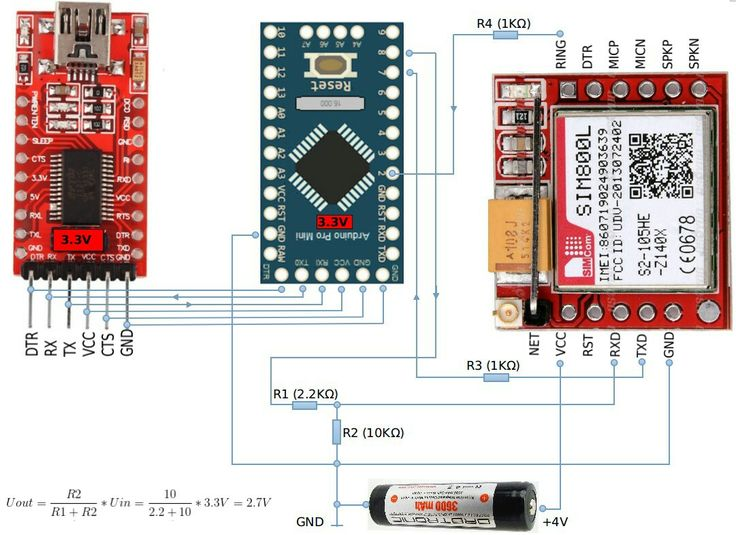

# YuaMQTT - Yet Another UART MQTT Library

[](https://github.com/EdwinKestler/SIM800_MQTT/actions/workflows/ci.yml)
[](LICENSE)
[](CHANGELOG.md)
[](library.properties)
[](library.json)

An Arduino library for communicating with MQTT 5.0 brokers via SIM800/SIM900 GPRS modules.
Designed specifically for Arduino Uno's constrained environment (2KB RAM, 32KB flash).

## Architecture

```text
┌─────────────────────────────────┐
│         Your Arduino Sketch     │
├─────────────────────────────────┤
│  YuaMQTT.h  (core, transport-   │ ← Builds/parses MQTT V5 byte buffers
│              agnostic)          │    No I/O, no Serial dependency
├──────────────┬──────────────────┤
│ YuaMQTT      │  YuaMQTT         │ ← Optional module helpers
│ _SIM800.h    │  _SIM900.h       │    AT commands for GPRS TCP
└──────┬───────┴───────┬──────────┘
       │               │
   SIM800 module    SIM900 module
   (SoftwareSerial) (Serial1 / HW UART)
```

- **Core** (`YuaMQTT.h`): Pure packet construction and parsing. No Arduino dependency in the C code itself.
- **Module helpers** (optional): `YuaSIM800` / `YuaSIM900` classes wrap AT commands for GPRS attach, TCP connect, and raw data send/receive.

## Features

- **MQTT 5.0 Protocol**: CONNECT, CONNACK, PUBLISH, SUBSCRIBE, PINGREQ, DISCONNECT with V5 properties support
- **Spec-compliant encoding**: Variable Byte Integer for remaining length and properties length, type-aware property encoding per MQTT V5 specification
- **Hardware & Software Serial**: Works with `Serial1` (hardware UART) or `SoftwareSerial`
- **Memory efficient**: Preallocated 256-byte buffer, no dynamic allocation
- **Error handling**: All functions return packet length on success, negative error codes on failure
- **Module helpers included**: SIM800 and SIM900 AT command wrappers with debug output

## Installation

### Arduino IDE

1. Download or clone this repository
2. Navigate to `Sketch` -> `Include Library` -> `Add .ZIP Library...`
3. Select the downloaded folder

### PlatformIO

Add to `platformio.ini`:

```ini
lib_deps = https://github.com/EdwinKestler/SIM800_MQTT.git
```

## Getting Started — Arduino Pro Mini + SIM800L

### Hardware



#### Parts needed

| Part | Notes |
| --- | --- |
| Arduino Pro Mini 3.3V 8MHz | 3.3V version (not 5V) |
| SIM800L module | With antenna and SIM card inserted |
| FTDI USB-to-Serial adapter | 3.3V — for programming and debug serial |
| Li-ion battery or LDO PSU | **4V / 2A** for SIM800L (not from Arduino VCC!) |
| R1 = 2.2K, R2 = 10K | Voltage divider for TX level shifting |
| R3 = 1K | RST pull-up |
| Breadboard + jumper wires | |

#### Wiring

```text
FTDI 3.3V          Arduino Pro Mini 3.3V          SIM800L
─────────           ──────────────────            ────────
TX  ──────────────► RX
RX  ◄────────────── TX
VCC ──────────────► VCC
GND ──────────────► GND ────────────────────────► GND

                    D10 (SoftwareSerial TX) ─┐
                                   R1 (2.2K) ├──► SIM800L RXD
                                   R2 (10K)  ┘─► GND
                                     (divides 3.3V → 2.7V)

                    D11 (SoftwareSerial RX) ◄──── SIM800L TXD

                                   Battery +4V ──► SIM800L VCC
                                   Battery GND ──► SIM800L GND
```

**Important**: The SIM800L needs **4V at up to 2A** peak during transmission. Do NOT power it from the Arduino's 3.3V regulator — it will brown out. Use a dedicated Li-ion cell (3.7-4.2V) or a 4V LDO.

The voltage divider (R1=2.2K, R2=10K) drops the Arduino's 3.3V TX to ~2.7V, which is safe for the SIM800L's 2.8V logic input. The SIM800L's TXD output is already at 2.8V, which the Arduino reads as HIGH at 3.3V — no level shifter needed on that line.

### Step 1: Install the MQTT V5 broker (Mosquitto)

Mosquitto is the simplest MQTT broker with V5 support. Install it on any PC on your network (or a Raspberry Pi).

**Linux (Debian/Ubuntu):**

```bash
sudo apt install mosquitto mosquitto-clients
```

**Windows:**

Download from [mosquitto.org/download](https://mosquitto.org/download/) and install.

**macOS:**

```bash
brew install mosquitto
```

Create a minimal config that enables MQTT V5 and allows anonymous access for testing:

```bash
# Create or edit /etc/mosquitto/conf.d/yuamqtt_test.conf
cat << 'EOF' | sudo tee /etc/mosquitto/conf.d/yuamqtt_test.conf
listener 1883
allow_anonymous true
EOF
```

Restart Mosquitto:

```bash
sudo systemctl restart mosquitto
```

### Step 2: Test the broker from your PC

Open two terminals. In terminal 1, subscribe:

```bash
mosquitto_sub -V 5 -h localhost -t "test/topic" -v
```

In terminal 2, publish:

```bash
mosquitto_pub -V 5 -h localhost -t "test/topic" -m "hello from PC"
```

You should see `test/topic hello from PC` appear in terminal 1. Your broker is working.

### Step 3: Find your broker's IP address

```bash
# Linux/macOS
hostname -I

# Windows
ipconfig
```

Note the IP (e.g., `192.168.1.100`). The Arduino will connect to this IP over GPRS.

### Step 4: Upload the sketch

Make sure the SIM card has an active data plan and you know the APN (ask your carrier).

Open `examples/BasicPublish/BasicPublish.ino` in Arduino IDE. Modify the sketch to use the SIM800 helper and your broker IP:

```cpp
#include <YuaMQTT.h>
#include <YuaMQTT_SIM800.h>
#include <SoftwareSerial.h>

SoftwareSerial simSerial(10, 11);  // TX=D10, RX=D11
YuaSIM800 sim(simSerial, &Serial); // debug on USB serial

void setup() {
    Serial.begin(9600);
    simSerial.begin(9600);
    delay(3000);  // wait for SIM800L to boot

    Serial.println("Starting...");

    if (!sim.begin()) {
        Serial.println("SIM800 not responding!");
        while (1);
    }

    Serial.print("Signal: ");
    Serial.println(sim.signalQuality());

    // Replace "your-apn" with your carrier's APN
    if (!sim.gprsConnect("your-apn")) {
        Serial.println("GPRS failed!");
        while (1);
    }

    // Replace with your broker's IP
    if (!sim.tcpConnect("192.168.1.100", 1883)) {
        Serial.println("TCP failed!");
        while (1);
    }

    // Send MQTT V5 CONNECT
    int len = mqtt_v5_connect_message(preallocated_mqtt_buffer,
                "arduino_mini", MQTT_DEFAULT_KEEP_ALIVE, NULL, 0);
    if (len > 0) sim.tcpSend(preallocated_mqtt_buffer, len);
}

void loop() {
    int len = mqtt_v5_publish_message(preallocated_mqtt_buffer,
                "test/topic", "{\"temp\":25}", NULL, 0);
    if (len > 0) {
        sim.tcpSend(preallocated_mqtt_buffer, len);
        Serial.println("Published!");
    }
    delay(5000);
}
```

Select **Tools > Board > Arduino Pro or Pro Mini** and **Tools > Processor > ATmega328P (3.3V, 8MHz)**. Upload via the FTDI adapter.

### Step 5: Verify

On your PC terminal running `mosquitto_sub`, you should see:

```text
test/topic {"temp":25}
test/topic {"temp":25}
...
```

Open **Tools > Serial Monitor** at 9600 baud to see debug output from the SIM800 AT commands.

### Troubleshooting

| Problem | Fix |
| --- | --- |
| SIM800 not responding | Check 4V power, wait 3-5s after power-on, verify GND is shared |
| Signal quality = 99 | Antenna not connected, or no network coverage |
| GPRS failed | Wrong APN — check with your carrier |
| TCP failed | Broker not reachable from mobile network (firewall/NAT). Try a public broker like `test.mosquitto.org` |
| No data in mosquitto_sub | Check broker allows anonymous + MQTT V5 (`-V 5` flag) |

## Quick Start

### Using the SIM800 module helper

```cpp
#include <YuaMQTT.h>
#include <YuaMQTT_SIM800.h>
#include <SoftwareSerial.h>

SoftwareSerial simSerial(10, 11);
YuaSIM800 sim(simSerial, &Serial);  // debug output on Serial

void setup() {
    Serial.begin(9600);
    simSerial.begin(9600);

    sim.begin();
    sim.gprsConnect("your-apn");
    sim.tcpConnect("broker.example.com", 1883);

    // Build and send MQTT CONNECT
    int len = mqtt_v5_connect_message(preallocated_mqtt_buffer,
                "my_client", MQTT_DEFAULT_KEEP_ALIVE, NULL, 0);
    if (len > 0) sim.tcpSend(preallocated_mqtt_buffer, len);
}

void loop() {
    int len = mqtt_v5_publish_message(preallocated_mqtt_buffer,
                "sensor/data", "{\"temp\":25}", NULL, 0);
    if (len > 0) sim.tcpSend(preallocated_mqtt_buffer, len);
    delay(5000);
}
```

### Core library only (transport-agnostic)

```cpp
#include <YuaMQTT.h>

// Build a CONNECT packet into the preallocated buffer
mqtt_property props[1];
uint8_t session_expiry[4] = {0, 0, 0, 60};
props[0].property_id = 0x11;
props[0].length = 4;
props[0].value = session_expiry;

int len = mqtt_v5_connect_message(preallocated_mqtt_buffer,
            "my_client", 15, props, 1);
if (len > 0) {
    // Send preallocated_mqtt_buffer[0..len-1] over your transport
}
```

## API Reference

All construction functions return **packet length** (positive int) on success, or a **negative error code** on failure:

- `-1`: NULL parameter provided
- `-2`: Buffer overflow (message exceeds `MQTT_BUFFER_SIZE`)

### MQTT V5 Core Functions

#### `int mqtt_v5_connect_message(uint8_t *buf, const char *client_id, uint16_t keep_alive, mqtt_property *props, uint8_t prop_count)`

Constructs an MQTT V5 CONNECT packet with Clean Start flag and configurable keep-alive.

#### `int mqtt_v5_publish_message(uint8_t *buf, const char *topic, const char *message, mqtt_property *props, uint8_t prop_count)`

Constructs an MQTT V5 PUBLISH packet (QoS 0).

#### `int mqtt_v5_subscribe_message(uint8_t *buf, uint16_t packet_id, const char *topic, uint8_t qos, mqtt_property *props, uint8_t prop_count)`

Constructs an MQTT V5 SUBSCRIBE packet with configurable packet identifier.

#### `int mqtt_v5_disconnect_message(uint8_t *buf)`

Constructs a minimal MQTT V5 DISCONNECT packet (reason code 0x00).

#### `int mqtt_v5_pingreq_message(uint8_t *buf)`

Constructs a PINGREQ packet. Must be sent within the keep-alive interval to prevent the broker from disconnecting.

#### `int mqtt_v5_parse_connack(const uint8_t *buf, uint8_t *session_present, uint8_t *reason_code)`

Parses a CONNACK response. Returns 0 on success, -3 if connection was refused (reason_code contains the code).

#### `int mqtt_v5_parse_suback_message(const uint8_t *buf, uint16_t *packet_id, uint8_t *reason_code)`

Parses a SUBACK response. Returns 0 on success.

#### `int mqtt_v5_parse_publish(const uint8_t *buf, uint16_t msg_len, char *topic, uint16_t topic_buf_size, uint8_t *payload, uint16_t payload_buf_size, uint16_t *topic_len_out, uint16_t *payload_len_out)`

Parses an incoming PUBLISH message, extracting topic and payload into caller-provided buffers. Returns 0 on success.

#### `int mqtt_v5_is_pingresp(const uint8_t *buf)`

Returns 1 if the message is a PINGRESP, 0 otherwise.

#### `int mqtt_v5_encode_vbi(uint8_t *buf, uint32_t value)` / `int mqtt_v5_decode_vbi(const uint8_t *buf, uint32_t *value)`

MQTT Variable Byte Integer encoding/decoding utilities.

### SIM800 Module Helper

```cpp
#include <YuaMQTT_SIM800.h>

YuaSIM800 sim(simSerial, &Serial);  // second arg is optional debug stream
```

| Method | Description |
| --- | --- |
| `begin()` | Send AT, verify module responds |
| `signalQuality()` | AT+CSQ, returns RSSI (0-31, 99=unknown) |
| `gprsConnect(apn, user, pass)` | Set APN, bring up GPRS, get IP |
| `gprsDisconnect()` | AT+CIPSHUT |
| `tcpConnect(host, port)` | Open TCP socket to MQTT broker |
| `tcpClose()` | Close TCP socket |
| `tcpSend(data, len)` | Send raw bytes via AT+CIPSEND |
| `tcpRead(buf, size, timeout)` | Read available bytes from module |
| `sendATCommand(cmd, expected, timeout)` | Send any AT command |

### SIM900 Module Helper

```cpp
#include <YuaMQTT_SIM900.h>

YuaSIM900 sim(Serial1, &Serial);  // hardware UART recommended
```

Same API as `YuaSIM800`. See `docs/SIM900_AT_Commands.md` for AT command details.

### Properties

Properties use the `mqtt_property` struct:

```cpp
typedef struct {
    uint8_t property_id;   // MQTT V5 property identifier
    uint16_t length;       // Value length in bytes
    uint8_t *value;        // Pointer to value data (big-endian for integers)
} mqtt_property;
```

Common property IDs:

| ID | Name | Type | Size |
| --- | --- | --- | --- |
| `0x11` | Session Expiry Interval | Four Byte Int | 4 |
| `0x03` | Content Type | UTF-8 String | variable |
| `0x0B` | Subscription Identifier | Variable Byte Int | 1-4 |
| `0x21` | Receive Maximum | Two Byte Int | 2 |
| `0x01` | Payload Format Indicator | Byte | 1 |

## Examples

- **BasicPublish** - Publish sensor data with Content Type property
- **BasicSubscribe** - Subscribe to a topic and parse SUBACK
- **FullLoopTest** - Complete minimal session: CONNECT, verify CONNACK, SUBSCRIBE, PUBLISH, parse incoming PUBLISH, PINGREQ keep-alive
- **FullLoopSIM800** - Full loop with GPRS configuration
- **FullLoopJSON** - Full loop with ArduinoJson parsing (requires ArduinoJson library)
- **HardwareSerialPublish** - Hardware UART (Serial1) with SIM800 helper, GPRS, and keep-alive (Mega, ESP32, STM32, RP2040)

## Memory Footprint

Compiled with Arduino CLI 1.4.1, AVR core 1.8.7 (avr-gcc 7.3.0).

| Example | Board | Flash | Flash % | RAM | RAM % | Free RAM |
| --- | --- | ---: | ---: | ---: | ---: | ---: |
| BasicPublish | Uno | 4,826 B | 14% | 757 B | 36% | 1,291 B |
| BasicSubscribe | Uno | 5,266 B | 16% | 679 B | 33% | 1,369 B |
| FullLoopTest | Uno | 6,580 B | 20% | 1,288 B | 62% | 760 B |
| FullLoopSIM800 | Uno | 8,312 B | 25% | 1,379 B | 67% | 669 B |
| FullLoopJSON | Uno | 13,564 B | 42% | 1,549 B | 75% | 499 B |
| HardwareSerialPublish | Mega | 8,786 B | 3% | 984 B | 12% | 7,208 B |

**Arduino Uno limits**: 32,256 bytes flash, 2,048 bytes RAM.

- **BasicPublish / BasicSubscribe** are very comfortable at 14–16% flash and 33–36% RAM — plenty of room for application logic.
- **FullLoopSIM800** fits well at 25% flash and 67% RAM. The 669 bytes free for stack is tight but workable since the call stacks are shallow.
- **FullLoopJSON** is the tightest at 75% RAM (499 bytes free). The compiler warns "Low memory available, stability problems may occur." If you need JSON parsing on Uno, reduce `MAX_MESSAGE_SIZE` from 128 to 64 or use a smaller `StaticJsonDocument`.
- **HardwareSerialPublish** on Mega uses only 3% flash / 12% RAM — multi-UART boards have headroom to spare.

### Reproduce these results with Arduino CLI

Install the Arduino CLI and AVR core:

```bash
# Install Arduino CLI (Linux/macOS)
curl -fsSL https://raw.githubusercontent.com/arduino/arduino-cli/master/install.sh | sh

# Windows — download from https://arduino.github.io/arduino-cli/installation/

# Install the AVR core
arduino-cli core update-index
arduino-cli core install arduino:avr
```

Clone the repo and compile any example:

```bash
git clone https://github.com/EdwinKestler/SIM800_MQTT.git
cd SIM800_MQTT

# Compile for Arduino Uno
arduino-cli compile --fqbn arduino:avr:uno --libraries . examples/BasicPublish
arduino-cli compile --fqbn arduino:avr:uno --libraries . examples/BasicSubscribe
arduino-cli compile --fqbn arduino:avr:uno --libraries . examples/FullLoopTest
arduino-cli compile --fqbn arduino:avr:uno --libraries . examples/FullLoopSIM800
arduino-cli compile --fqbn arduino:avr:uno --libraries . examples/FullLoopJSON  # needs ArduinoJson (see below)

# Compile for Arduino Mega
arduino-cli compile --fqbn arduino:avr:mega --libraries . examples/HardwareSerialPublish
```

The FullLoopJSON example requires the ArduinoJson library:

```bash
arduino-cli lib install ArduinoJson
arduino-cli compile --fqbn arduino:avr:uno --libraries . examples/FullLoopJSON
```

Each compile prints flash and RAM usage at the end, e.g.:

```text
Sketch uses 8312 bytes (25%) of program storage space. Maximum is 32256 bytes.
Global variables use 1379 bytes (67%) of dynamic memory, leaving 669 bytes for local variables.
```

## Supported Boards

- **Single UART**: Arduino Uno, Nano (requires SoftwareSerial) - primary target
- **Multi-UART**: Arduino Mega, Leonardo, Due (recommended for SIM900, use `Serial1`)

## Current Implementation Status

| Step | Packet | Direction | Function | Status |
| --- | --- | --- | --- | --- |
| 1 | CONNECT | Client -> Broker | `mqtt_v5_connect_message()` | Implemented |
| 2 | CONNACK | Broker -> Client | `mqtt_v5_parse_connack()` | Implemented |
| 3 | SUBSCRIBE | Client -> Broker | `mqtt_v5_subscribe_message()` | Implemented |
| 4 | SUBACK | Broker -> Client | `mqtt_v5_parse_suback_message()` | Implemented |
| 5 | PUBLISH (out) | Client -> Broker | `mqtt_v5_publish_message()` | Implemented |
| 6 | PUBLISH (in) | Broker -> Client | `mqtt_v5_parse_publish()` | Implemented |
| 7 | PINGREQ | Client -> Broker | `mqtt_v5_pingreq_message()` | Implemented |
| 8 | PINGRESP | Broker -> Client | `mqtt_v5_is_pingresp()` | Implemented |
| 9 | DISCONNECT | Client -> Broker | `mqtt_v5_disconnect_message()` | Implemented |

## Future Work - Complete MQTT V5 Protocol Coverage

| Step | Packet | Direction | Description | Status |
| --- | --- | --- | --- | --- |
| | **Authentication** | | | |
| 1 | CONNECT + credentials | Client -> Broker | Username/password fields in CONNECT flags and payload | Planned |
| 2 | AUTH | Bidirectional | Enhanced authentication exchange (SCRAM, Kerberos) | Planned |
| | **Will Messages** | | | |
| 3 | CONNECT + Will | Client -> Broker | Will flag, Will QoS, Will Retain, Will Properties, Will Topic, Will Payload in CONNECT | Planned |
| | **QoS 1 - At Least Once** | | | |
| 4 | PUBLISH QoS 1 (out) | Client -> Broker | PUBLISH with QoS 1 flag + Packet Identifier | Planned |
| 5 | PUBACK (in) | Broker -> Client | Parse broker acknowledgement for QoS 1 PUBLISH | Planned |
| 6 | PUBLISH QoS 1 (in) | Broker -> Client | Parse incoming QoS 1 PUBLISH from subscriptions | Planned |
| 7 | PUBACK (out) | Client -> Broker | Acknowledge received QoS 1 PUBLISH | Planned |
| | **QoS 2 - Exactly Once** | | | |
| 8 | PUBLISH QoS 2 (out) | Client -> Broker | PUBLISH with QoS 2 flag + Packet Identifier | Planned |
| 9 | PUBREC (in) | Broker -> Client | Parse PUBREC (publish received) | Planned |
| 10 | PUBREL (out) | Client -> Broker | Construct PUBREL (publish release) | Planned |
| 11 | PUBCOMP (in) | Broker -> Client | Parse PUBCOMP (publish complete) | Planned |
| 12 | PUBLISH QoS 2 (in) | Broker -> Client | Parse incoming QoS 2 PUBLISH | Planned |
| 13 | PUBREC (out) | Client -> Broker | Construct PUBREC for received QoS 2 | Planned |
| 14 | PUBREL (in) | Broker -> Client | Parse PUBREL from broker | Planned |
| 15 | PUBCOMP (out) | Client -> Broker | Construct PUBCOMP to complete QoS 2 | Planned |
| | **Subscription Management** | | | |
| 16 | UNSUBSCRIBE | Client -> Broker | Construct UNSUBSCRIBE with topic filters | Planned |
| 17 | UNSUBACK | Broker -> Client | Parse UNSUBACK with per-topic reason codes | Planned |
| | **Advanced Features** | | | |
| 18 | DISCONNECT + Reason | Client -> Broker | DISCONNECT with reason code and properties | Planned |
| 19 | DISCONNECT (in) | Broker -> Client | Parse server-initiated DISCONNECT with reason | Planned |
| 20 | Topic Alias | Bidirectional | Reduce bandwidth by mapping topics to integer aliases | Planned |
| 21 | Request/Response | Bidirectional | Response Topic + Correlation Data properties | Planned |
| 22 | Shared Subscriptions | Client -> Broker | `$share/group/topic` subscription format | Planned |

## Documentation

- [SIM800 AT Command Reference](docs/SIM800_AT_Commands.md)
- [SIM900 AT Command Reference](docs/SIM900_AT_Commands.md)
- Full manufacturer AT command manuals are in the `docs/` folder (PDF)

### Generate API docs (Doxygen)

```bash
doxygen Doxyfile
# Open docs/api/html/index.html in your browser
```

## Legacy

The original MQTT 3.1 library files (tested since 2012) are preserved in the `legacy/` folder for reference.

## License

MIT License - see [LICENSE](LICENSE) for details.
